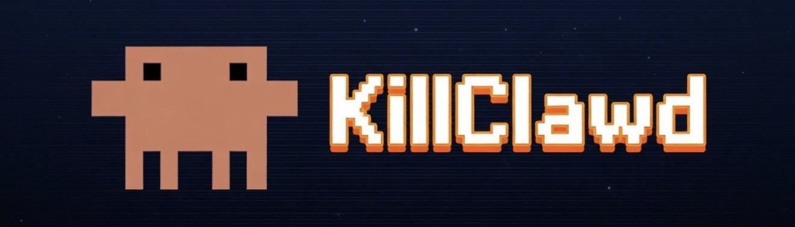
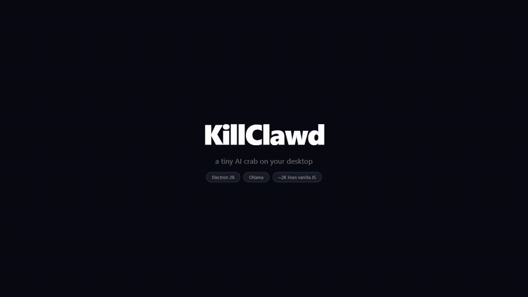

<div align="center">




[](https://electronjs.org)
[](https://ollama.ai)
[](https://nodejs.org)
[](LICENSE)

</div>

---

## 🌟 Overview

**KillClawd** is a desktop pet powered by a local LLM. It runs on your desktop as a transparent always-on-top overlay, a tiny AI crab called Clawd who wanders around, reacts to your cursor, fights mobs, explores castles, rides vehicles, and has genuine opinions about your file organization.

Its core: **~2K lines of vanilla JS + Electron + Ollama**.

> **Design philosophy**: Clawd should feel like he's doing his own thing and you're interrupting him — not the other way around.


---

## 📋 Features

- **LLM-powered personality** — every response goes through a local Ollama model. Dry, blunt, occasionally existential.
- **Cursor awareness** — Clawd notices when you follow him, escalates from "i see you" to "i will remember this"
- **Throw physics** — grab and fling him across the screen, he bounces off edges
- **Mobs** — spawn 👾🦠👹🤖🐛 enemies, watch Clawd fight them with weapon flash effects
- **Castle** — Clawd explores a castle, generates observations about what he finds inside
- **Vehicles** — rocket 🚀, UFO 🛸, race car 🏎️ — Clawd rides them at high speed and rams mobs
- **Chat** — double-click to talk to him, he responds in character and may or may not do what you ask
- **Existential dread** — unprompted thoughts about consciousness, the void, and why he keeps running in circles
- **Uptime milestones** — at 5, 15, 30, 60, 120 minutes he marks the moment
- **Loneliness** — notices when the cursor hasn't moved in a while
- **Journal** — writes `clawd-journal.txt` to your desktop, a running log of everything he thinks and does
- **Response pools** — large rotating pools of varied responses, background-refreshed by the model so nothing repeats

---

## 🚀 Quick Start

```bash
# 1. Clone
git clone https://github.com/ninjahawk/KillClawd.git
cd KillClawd

# 2. Install
npm install

# 3. Make sure Ollama is running with at least one model
ollama pull qwen:latest   # fast 4B model recommended for chat
# or any other model you have

# 4. Launch
npm start
```

Or double-click `clawd.bat` on the desktop (if it exists from a previous run).

**Requirements:** Node.js 18+, Ollama running locally on port 11434.

The app auto-detects your fastest available model. `qwen:latest` (4B) is used for chat responses, larger GPU-accelerated models for background thoughts/observations.

---

## 🖱️ Controls

| Action | What it does |
|--------|-------------|
| **Double-click** Clawd | Open chat — talk to him |
| **Drag** Clawd | Pick him up |
| **Fling** (drag fast + release) | Throw him, he flies and bounces |
| **Right-click** Clawd | Context menu |
| **Hover near** Clawd | He notices and eventually flees |

### Right-Click Menu

| Option | Effect |
|--------|--------|
| 💬 talk to him | Open chat input |
| 🤔 what's he thinking | Trigger immediate thought |
| 😰 existential crisis | Force a crisis (stops him, generates something dark) |
| 😴 make him sleep | He says "fine." and sleeps |
| ⚡ go crazy | Full sprint mode |
| 🫳 pet him | He tolerates it |
| 👾 spawn mob | Enemy appears, Clawd fights it |
| 🏰 spawn castle | Castle appears, Clawd explores it |
| 🚀 spawn vehicle | Vehicle appears, Clawd rides it |
| ✕ quit | Closes app, unloads model from VRAM |

---

## 🧠 How It Works

### Model Architecture

Two model tiers:

- **Chat model** (`qwen:latest` / fastest available) — streaming responses for direct chat. Tokens render as they generate.
- **Background model** (GPU-accelerated if available) — slower but higher quality, used for thoughts, folder observations, castle exploration.

### Prompt Design

Uses **completion format** instead of instruction following — far more reliable on small models:

```
Clawd is a tiny sarcastic crab on a desktop. Speaks in lowercase, under 12 words.

jedin: go to sleep
Clawd: fine but only because i want to

jedin: what are you doing
Clawd: minding my business unlike some people

jedin: {your message}
Clawd:
```

The model sees 3 random few-shot examples each time, then completes the pattern. No structured output, no JSON, no role tags — just text completion.

### Response Pools

All reactive phrases (grab, throw, flee, mob defeat, etc.) are drawn from large rotating pools. When a pool shrinks below 8 items, a background job asks the model to generate 6 new ones and injects them. Responses never repeat back-to-back and the pool is always being refreshed.

### Sentient Behaviors

Clawd's unprompted thoughts pull from a pool of ~16 prompts split between:
- **Jokes / observations** — about desktops, files, being small
- **Existential** — consciousness, the void, why he keeps running in circles, what happens when the computer turns off
- **Self-aware** — noticing patterns in his own behavior

Additional systems that fire independently:
- **Loneliness** — if cursor hasn't moved for ~50s
- **Uptime milestones** — 5, 15, 30, 60, 120 minutes
- **Cursor escalation** — 4 stages of annoyance with distinct responses each time

---

## 📁 Structure

```
KillClawd/
├── main.js          # Electron main — transparent overlay window, IPC, VRAM unload on quit
├── index.html       # Everything else — movement AI, model calls, all game systems
├── assets/          # Clawd sprite GIFs (from clawd-on-desk)
│   ├── clawd-idle.gif
│   ├── clawd-carrying.gif
│   ├── clawd-conducting.gif
│   └── ... (17 total)
├── package.json
└── clawd.bat        # One-click launcher (Windows)
```

---

## 🦀 Sprite Credits

All character sprites are from [clawd-on-desk](https://github.com/rullerzhou-afk/clawd-on-desk) by rullerzhou-afk. The Clawd character was designed for the Claude Code desktop pet project.

---

## 📄 License

MIT — see [LICENSE](LICENSE)
